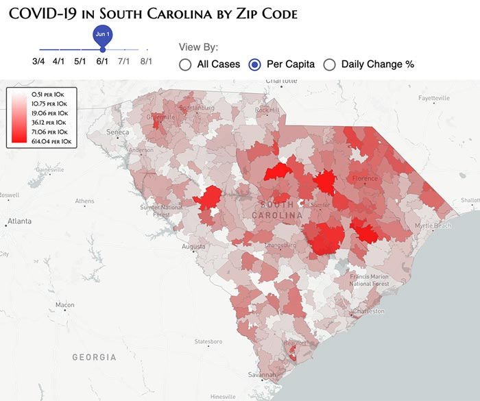

# Map Visualization: COVID-19 in South Carolina by Zip Code

[App link](https://davidcalhoun.github.io/covid-19-map-south-carolina/)

## Intro
After [SC DHEC](https://www.scdhec.gov) started regularly publishing a PDF of affected zip codes in the state of South Carolina (where I'm at currently), I thought it would be a fun exercise to track case over time on a map visualization.

Here's a [link to the COVID-19 in South Carolina visualization](https://davidcalhoun.github.io/covid-19-map-south-carolina/)!.

## Implementation
* Zip code GeoJSON comes from [https://github.com/OpenDataDE/State-zip-code-GeoJSON](OpenDataDE/State-zip-code-GeoJSON)
* Zip code GeoJSON minified with [https://github.com/maxogden/simplify-geojson](simplify-geojson)

## Data
* Each [day's data files are here](https://github.com/davidcalhoun/covid-19-map-south-carolina/tree/master/data).  If you see a discrepancy somewhere, please help me out and submit a pull request!

* Note that the color legend for Per Capita cases only uses data for zip codes with a population greater than 100.  This is because unusually small zip codes (such as 29912) heavily skew the data.

* PDFs published by [SC DHEC](https://www.scdhec.gov) unfortunately need to be semi-manually processed:
  * PDF converted to TXT through [pdftotext.com OCR import](https://pdftotext.com/)
  * Manual data cleanup (fixing out-of-order county names with data, removing special characters).
  * TXT converted to JSON with a [custom Node.js script](https://github.com/davidcalhoun/covid-19-map-south-carolina/blob/master/scripts/index.js)
  * Recommendation to SC DHEC: please provide the data in a better form, ideally JSON, or even CSV!

* PDF archives
  * Note: prior to April 10, SC DHEC published PDF reports of zipcode breakdowns:
    * [3/26](https://scdhec.gov/sites/default/files/media/document/Covid-Zip-Code-Analysis-3_27_2020.pdf)
    * [4/2](https://scdhec.gov/sites/default/files/media/document/Covid%20Zip%20Analysis%204_3_2020%20No%20Estimates_0.pdf)
    * [4/3](https://scdhec.gov/sites/default/files/media/document/Covid%20Zip%20Code%20Analysis_Public_4_4_20.pdf)
    * [4/4](https://scdhec.gov/sites/default/files/media/document/Covid-Zip-Code-Analysis-Public-4_5_2020.pdf)
    * [4/5](https://www.scdhec.gov/sites/default/files/media/document/Zip%20Code%20Counts%20and%20Estimated%20Numbers%20Updated_4_6_2020_0.pdf)
    * [4/6](https://scdhec.gov/sites/default/files/media/document/COVID19_Zip_Code_Counts_and_Estimates_Public-04.07.2020.pdf)
    * [4/7](https://www.scdhec.gov/sites/default/files/media/document/COVID19_Zip_Code_Counts_and_Estimated_Numbers-04.08.2020.pdf)
    * [4/8](https://www.scdhec.gov/sites/default/files/media/document/Zip-Code-Counts-Estimated-Numbers-4_9_2020.pdf)
    * [4/9](https://www.scdhec.gov/sites/default/files/media/document/COVID19_Zip_Code_Analysis_Public-04.10.2020.pdf)
  * Starting April 10, SC DHEC made zip code breakdowns available via a Tableau dashboard.  I've [archived daily PDF exports from this dashboard](https://github.com/davidcalhoun/covid-19-data-south-carolina/tree/master/data).

* Color coding is achieved by using the entire date range as the data domain, then breaking this dataset into 255 [quantiles](https://github.com/d3/d3-scale#quantile-scales) for red coloring (RGB pallette) and 10 quantiles for opacity.  For instance, the smallest value will have 0 red coloring and 0 opacity, whereas the highest value will have 255 red coloring and 100% opacity (in reality adjusted to be slightly lower so users can still see the underlying map).

## Browser Support
I tested this in the latest browsers available to run on macOS.  Not yet optimized to work on smaller screens (mobile), sorry!

Tested with:
* Firefox 74.0.1
* Chrome 80.0.3987.163
* Edge 80.0.361.109
* Safari 13.1

## Local Development

1. Install Node, which comes with npm
1. Clone this repo: `git clone git@github.com:davidcalhoun/covid-19-map-south-carolina.git && cd covid-19-map-south-carolina`
1. Install dependencies: `npm install`
1. Run Webpack Dev Server: `npm start`
1. A browser window should automatically launch and open a tab to http://localhost:8080/  Any changes you make to the code should refresh in your browser window automatically.

